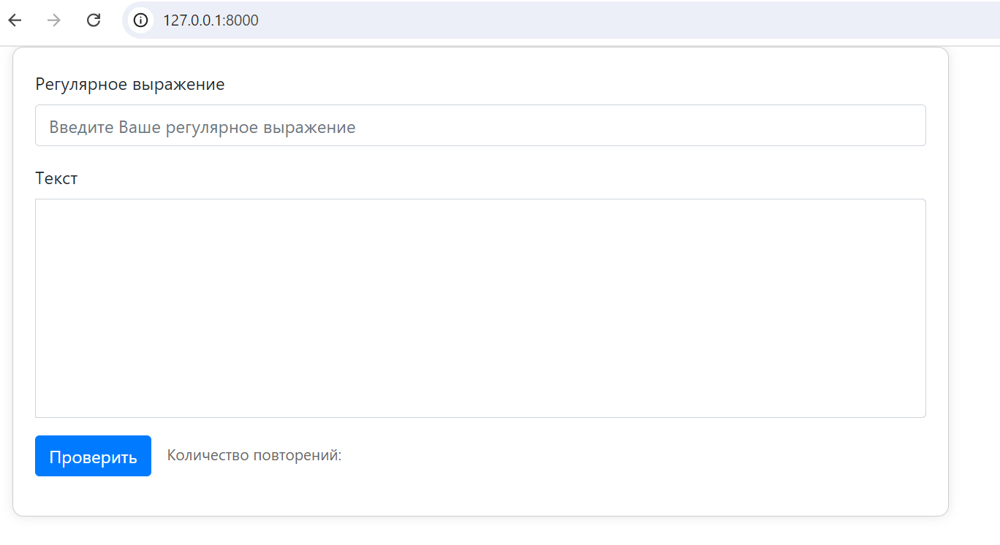
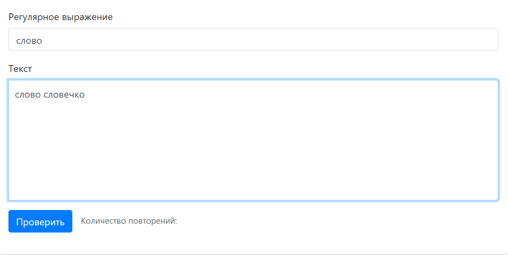
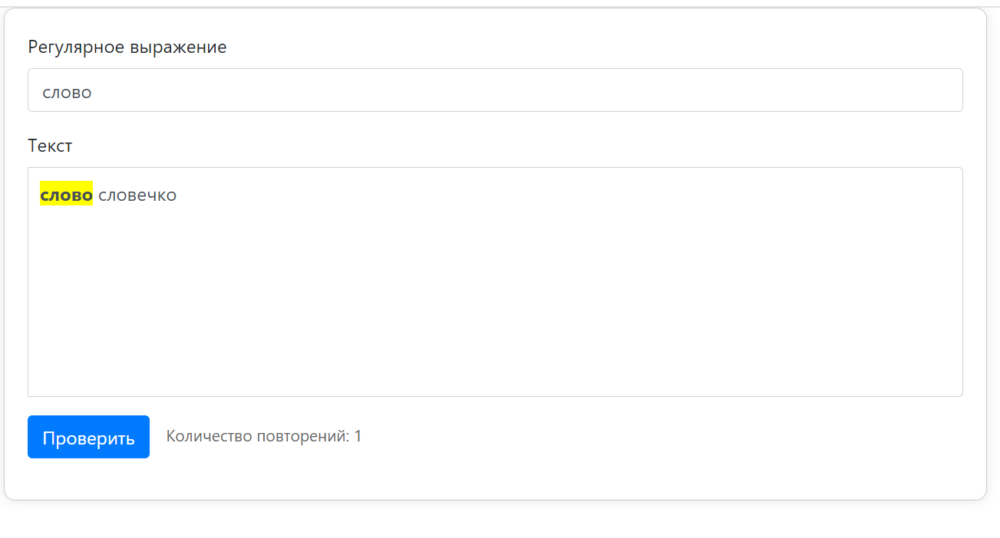
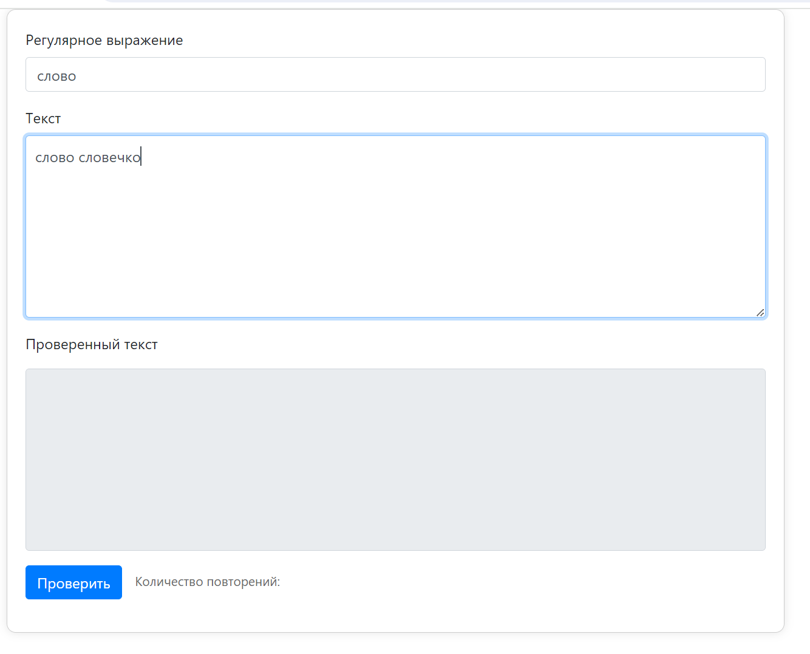
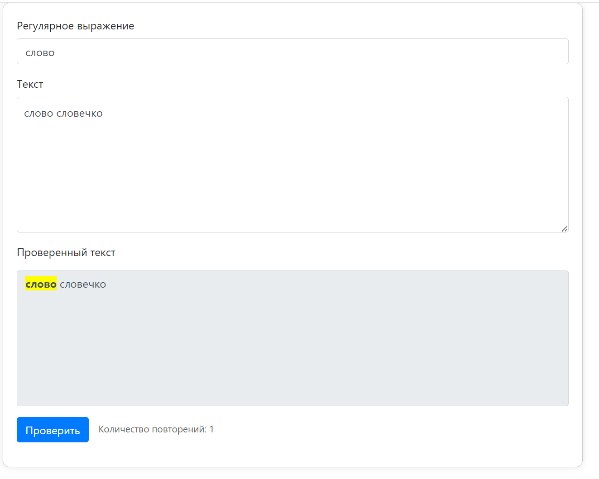

## Regex Query Tool

Технологии

- Используйте Django как основной веб-фреймворк
- Библиотеку [Re](https://w3schools.com/python/python_regex.asp) для работы с регулярными выражениями ([Что такое регулярки и зачем нужны](https://habr.com/ru/articles/545150/))
- Простой фронтенд, использование только HTML будет достаточно
- Так же может понадобится [BeautifulSoup (bs4)](https://habr.com/ru/articles/544828/) для парсинга

##

Примеры реализации:
- FreeFormatter
- RegexTester

##

Эндпоинты:

> В данной работе подразумевается один эндпоинт, но если для Вашей реализации нужны еще, то не ограничивайте себя 

Главная страница, **path**:  - <your_domain>/



Ваш фронтенд будет содержать по меньшей мере четыре основных объекта:
- Поле для регулярного выражения
- Поле для проверяемого текста
- Поле для отображения количества повторений
- Кнопка проверки



- Пользователь заполняет соответсвующие поля и нажимает кнопку проверки



- Выводится кол-во повторений
- Подсвечиваются совпадения соответствующие регулярному выражению
- Чтобы изменяемое поле "умело" подсвечивать cовпадения и корректно работало при дальнейших изменениях,
придется углубиться во фронтенд и JavaScript. Поэтому советуем добавить отдельное неизменеямое поле, которое копирует ввод пользователя в отдельное поле и подсвечивает совпадения:



- Нажимаем проверить



> Если все же решите сделать, как в примере и углубиться во фронтенд составляющую, то вам могут понадобится ```div``` с параметром [contenteditable](https://www.w3schools.com/tags/att_global_contenteditable.asp), ```input``` с параметром [type="hidden"](https://www.w3schools.com/tags/att_input_type_hidden.asp) и базовые методы объектов из JS, например, [.addEventListener](https://learn.javascript.ru/introduction-browser-events)

- Так же, если регулярное выражение невалидно, сообщаем об этом пользователю:


##

*Задание под звездочкой:
Сделать поле для замены всех совпадений и вывода измененного текста в отдельное поле*
